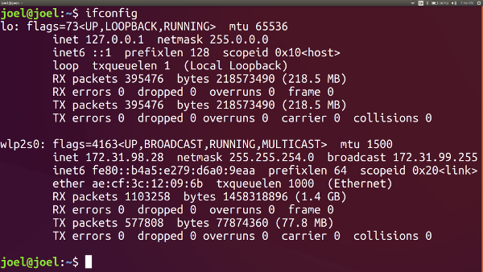

1. Ensure that development machine and all devices are connected to the same network.

2. Find the ip address of your development machine by typing in `ifconfig`.

In this case, the ip address of my machine is `172.31.98.28`.

3. Run the rails server by typing:

`rails server -b 0.0.0.0`

Now we have a local server running on `0.0.0.0:3000`

4. Visit your local server from a device that's connected to the same Local Area Network:

`172.31.98.28:3000`

5. That's it! You're done!
