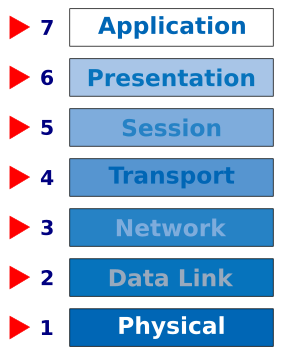

I was asked an interesting question by a senior web developer over a cup of coffee. The question was: "do you know how the web works?" In that moment it sounded like such a massive question, akin to "do you know how the universe works?" Both are expanding infinitely outwards and rapidly evolving and both are nearly impossible to explain in one sentence. It is impossible to 'know everything' about something that is constantly expanding and I would guess that even astrophysicists don't know everything about the universe.  

I have never been asked this question and I blurted out: "the entire internet?"  I think we both had a nice chuckle at my literal interpretation of the question. He followed up: "do you understand modern web protocols like `http` and `https`"? Fundamentally I understand how the internet works. At a high level, it is a superhighway of cables, wireless signals, servers and clients all communicating data with one another. Instead of people traveling on these highways, strings and numbers travel from one destination to another. However, I want to dive deeper and spend this post analyzing the layers that make up the internet. There are two primary models for explaining the functionality of the web. The TCP/IP networking model and the Open Systems Interconnection (OSI) model. This post will be a breakdown of the latter.

## The Open Systems Interconnection (OSI) Model

In order to to understand the difference between various internet protocols, we need to understand the concept of a [layered network model](https://en.wikipedia.org/wiki/OSI_model). This model is composed of layers and each layer has protocols that allow computers to communicate with one another at different distances and at different levels of abstraction. Let's start our analysis at the bottom of the stack and work our way up.

### Physical Layer

The bottom layer is called the physical layer and is where signals, pulses and waves transmit data from one place to another. There are not necessarily protocols present in this layer, only the engineering standards necessary for voltages, frequencies and other physical properties. It is possible to transmit data directly this way but it requires a lot of power or dedicated lines. And without the higher layers it would not be possible to share bandwidth.

### Link Layer

This layer involves communication between devices that share a physical communication medium. Protocols like Ethernet, 802.11a/b/g/n/ac, Token Ring determine how to handle multiple concurrent accesses to the physical medium. One of the major functions of the data link layer is to provide a MAC address so that requested information can find its destination.

### Network Layer

The network layer is where we find the Internet Protocol (IP) and it's where the magic of the Internet happens. Through this layer you can talk to a computer in another country without needing to know exactly where it is. IP addresses help packets navigate through the network to reach their proper destination.

### Transport layer

This is the quality control layer for the internet. We can talk to computers around the world but those computers are all running lots of different applications. The transport layer communicates with the correct application through port numbers. Transmission Control Protocol (TCP) and User Datagram Protocol (UDP) are the most popular transport protocols.

### Session Layer

The session layer makes it possible to establish an open communication line between two devices in order to send the requested packets. It establishes a mechanism for opening, closing and managing a session between end-user application processes and responses.

### Presentation Layer

The presentation layer is responsible for the delivery and formatting of information to the application layer for further processing or display. Encryption also occurs within this layer.

### Application Layer

The application layer is the top layer of the OSI model and is the user interface that the end-user interacts with to send or receive data. Application layer protocols handle requests to and from users and servers. HTTP and HTTPS are two important protocols that web developers should understand.

##### HTTP
HyperText Transfer Protocol (HTTP) is the foundation of data communication for the World Wide Web. It is the protocol for exchanging hypertext, the foundation of every website.  HTTP functions as a request-response protocol in the client-server computing model.

##### HTTPS
HTTPS or HTTP Secure is an adaption of the Hypertext Transfer Protocol for secure communication over a computer network. With HTTTP, packets travel out in the open and anyone with a packet sniffing software (like WireShark) can analyze the traffic at any point in its journey. In HTTPS, the communication protocol is encrypted by Transport Layer Security (TLS) or formerly, Secure Sockets Layer (SSL). TLS lives on a lower level in the network layer model. When a web request occurs, the TLS encryption occurs before the HTTP stuff happens. TLS uses private-public and symmetric key cryoptography for securing traffic.

##### Other Application Layer Protocols
SMTP, FTP, IMAP, POP, SSH, XMPP

### Summary

The layered network model is a a helpful computer science concept for understanding how the internet works. The TCP/IP network model has 5 layers versus the 7 layers of the OSI model. In reality, some protocols dance between the various layers or can work within multiple layers at once. For example, TLS/SSL provides encryption and session information between the network and transport layers. API's exist above the application layer and govern communication for modern web applications. Hopefully this summary allowed you to think about the internet differently. I encourage you to do more research about network models as this point only scratches the surface.
